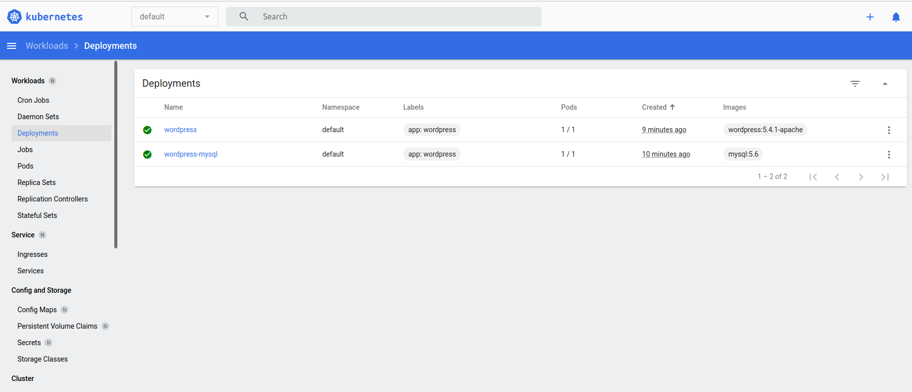

# Kubernetes and Minikube

## 1. Install Kubernetes using Minikube and specify Kubernetes components
### Update system

```shell
$ sudo apt update
$ sudo apt install apt-transport-https
$ sudo apt upgrade
```

### Install Docker

```shell
$ sudo apt install docker
```

### Install Minikube 

```shell
$ curl -Lo minikube https://storage.googleapis.com/minikube/releases/latest/minikube-linux-amd64 \
  && chmod +x minikube
```

**Put the binary ```minikube``` under /usr/local/bin directory since it is inside $PATH**

```shell
$ sudo mkdir -p /usr/local/bin/
$ sudo install minikube /usr/local/bin
```
### Confirm version installed

```shell
$ minikube version
```


### Install kubectl 

```shell
$ sudo curl -LO https://storage.googleapis.com/kubernetes-release/release/`curl -s https://storage.googleapis.com/kubernetes-release/release/stable.txt`/bin/linux/amd64/kubectl
```

**Make the kubectl binary executable.**

```shell
chmod +x ./kubectl
```

**Move the binary in to your PATH:**

```shell
$ sudo mv ./kubectl /usr/local/bin/kubectl
```

**Confirm version installed**

```shell
$ kubectl version
```


### Starting minikube with Docker driver

**```minikube``` can be deployed as a VM, a container, or bare-metal. Here, we use docker driver, a container-based**

**Add ```$USER``` to the group ```docker```**

```shell
$ sudo usermod -aG docker $USER
```
**Then change your users group ID to docker and reboot**
```shell
$ newgrp docker
$ reboot
```


## 2. Deploy Wordpress and MySQL using Minikube

#### Create a Kubernetes secret.

**Since WordPress stores it’s data on a MySQL database, we’ll need a secret in Kubernetes for the password. Use a secret to store MySQL password.**

**Firsts, create a base64 representation of your password:**

```shell
$ echo -n 'matkhau' | base64
```

**You can replace 'matkhau' by your password**


**Now, create and configure file ```secrets.yaml```, copy and paste password in the last line.**

```yaml
apiVersion: v1
kind: Secret
metadata:
  name: mysql-pass
type: Opaque
data:
  password: 
```

**And run command**

```shell
$ kubectl apply -f secrets.yaml
```


**Open minikube dashboard to view the newly created secret**

**Configure file ```mysql-deployment.yaml``` and deploy mysql**
- [```mysql-deployment.yaml```](./deploy-wordpress/mysql-deployment.yaml):

```yaml
apiVersion: v1
kind: Service
metadata:
  name: wordpress-mysql
  labels:
    app: wordpress
spec:
  ports:
    - port: 3306
  selector:
    app: wordpress
    tier: mysql
  clusterIP: None
---
apiVersion: v1
kind: PersistentVolumeClaim
metadata:
  name: mysql-pv-claim
  labels:
    app: wordpress
spec:
  accessModes:
    - ReadWriteOnce
  resources:
    requests:
      storage: 20Gi
---
apiVersion: apps/v1
kind: Deployment
metadata:
  name: wordpress-mysql
  labels:
    app: wordpress
spec:
  selector:
    matchLabels:
      app: wordpress
      tier: mysql
  strategy:
    type: Recreate
  template:
    metadata:
      labels:
        app: wordpress
        tier: mysql
    spec:
      containers:
        - image: mysql:5.6
          name: mysql
          env:
            - name: MYSQL_ROOT_PASSWORD
              valueFrom:
                secretKeyRef:
                  name: mysql-pass
                  key: password
          ports:
            - containerPort: 3306
              name: mysql
          readinessProbe:
            tcpSocket:
              port: 3306
            initialDelaySeconds: 5
            periodSeconds: 10
          livenessProbe:
            tcpSocket:
              port: 3306
            initialDelaySeconds: 15
            periodSeconds: 20
          volumeMounts:
            - name: mysql-persistent-storage
              mountPath: /var/lib/mysql
      volumes:
        - name: mysql-persistent-storage
          persistentVolumeClaim:
            claimName: mysql-pv-claim
```

**Run command**

```shel
$ kubectl apply -f mysql-deployment.yaml
```


**Configure file ```wordpress-deployment.yaml``` and deploy wordpress**
- [```wordpress-deployment.yaml```](./deploy-wordpress/wordpress-deployment.yaml):

```yaml
apiVersion: v1
kind: Service
metadata:
  name: wordpress
  labels:
    app: wordpress
spec:
  ports:
    - port: 80
  selector:
    app: wordpress
    tier: frontend
  type: LoadBalancer
---
apiVersion: v1
kind: PersistentVolumeClaim
metadata:
  name: wp-pv-claim
  labels:
    app: wordpress
spec:
  accessModes:
    - ReadWriteOnce
  resources:
    requests:
      storage: 20Gi
---
apiVersion: apps/v1
kind: Deployment
metadata:
  name: wordpress
  labels:
    app: wordpress
spec:
  selector:
    matchLabels:
      app: wordpress
      tier: frontend
  strategy:
    type: Recreate
  template:
    metadata:
      labels:
        app: wordpress
        tier: frontend
    spec:
      containers:
        - image: wordpress:5.4.1-apache
          name: wordpress

          env:
            - name: WORDPRESS_DB_HOST
              value: wordpress-mysql
            - name: WORDPRESS_DB_PASSWORD
              valueFrom:
                secretKeyRef:
                  name: mysql-pass
                  key: password
          ports:
            - containerPort: 80
              name: wordpress
          volumeMounts:
            - name: wordpress-persistent-storage
              mountPath: /var/www/html
      volumes:
        - name: wordpress-persistent-storage
          persistentVolumeClaim:
            claimName: wp-pv-claim

```

**Run command**

```shel
$ kubectl apply -f wordpress-deployment.yaml
```


**Now, check deployments with ```minikube dashboard```**



**Finally, get the URL of WordPress service and check wordpress website:**

```shell
$ minikube service wordpress --url
```


Open this URL in a browser and finish the installation.

